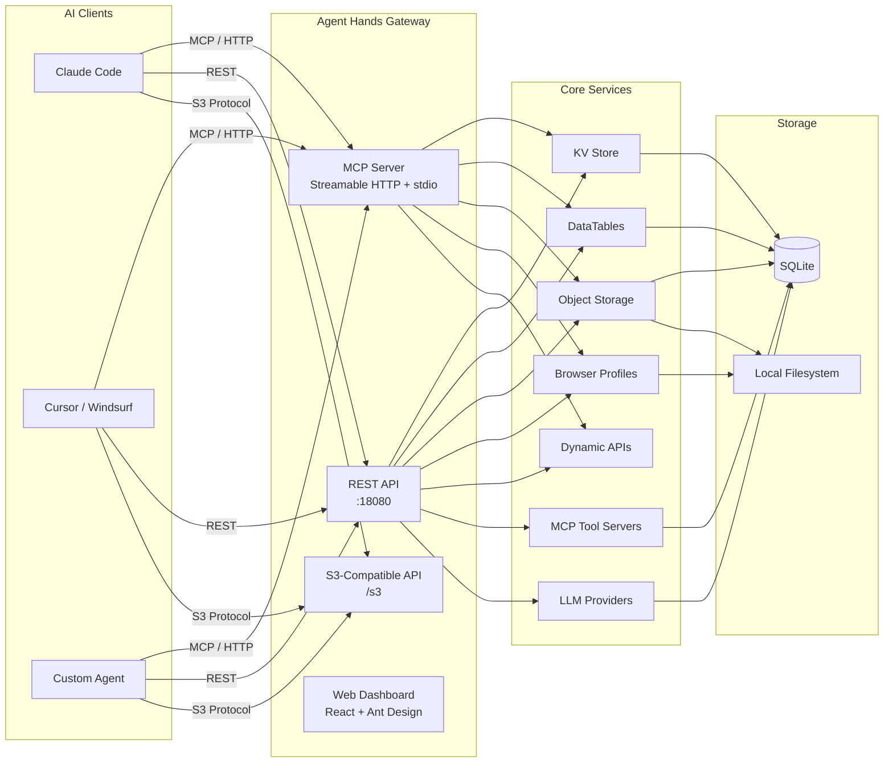
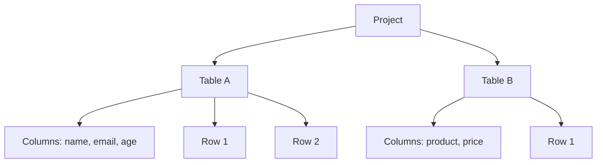
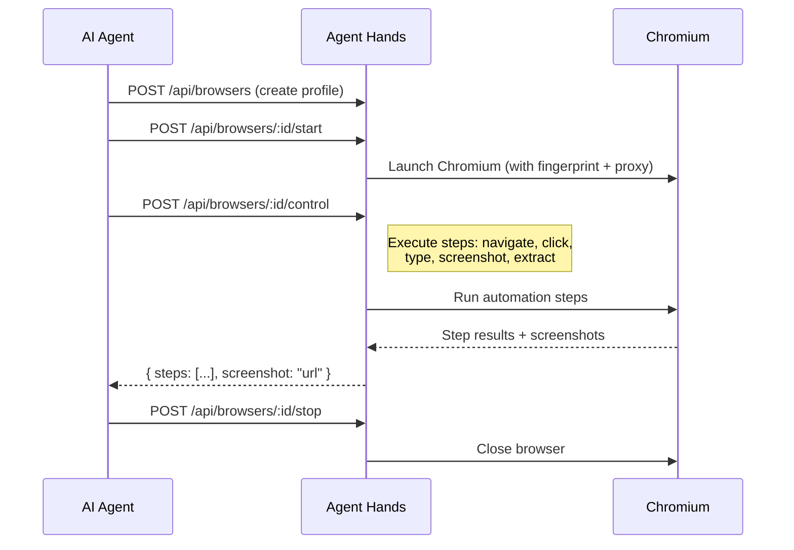
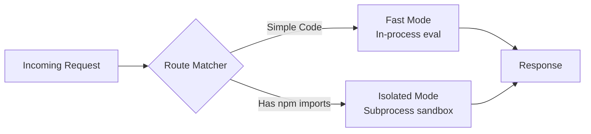

<p align="center">
  <h1 align="center">🤖 Agent Hands</h1>
  <p align="center">
    <strong>LLM-first knowledge base — Docs, DataTables, MCP server, S3-compatible file store.</strong>
  </p>
  <p align="center">
    <a href="https://github.com/Zobite/agent-hands/releases"></a>
    <a href="https://github.com/Zobite/agent-hands/blob/main/LICENSE"></a>
    
    
  </p>
</p>

---

## What is Agent Hands?

Agent Hands is a self-hosted backend gateway designed to give AI coding agents (Claude Code, Cursor, Windsurf, etc.) persistent memory and real-world capabilities. It exposes everything through an **MCP server** and a **REST API**, so your AI agents can store data, browse the web, execute code, and manage files — all from a single service.



---

## Quick Start

### Install (one-liner)

```bash
curl -fsSL https://raw.githubusercontent.com/Zobite/agent-hands/main/install.sh | bash
```

> **Prerequisite:** [Bun](https://bun.sh) runtime must be installed first.

The installer downloads the latest release, builds the server, installs Playwright/Chromium for browser automation, and starts the daemon on port `18080`.

### Default Credentials

| Field    | Value      |
| -------- | ---------- |
| Username | `admin`    |
| Password | `admin123` |

> ⚠️ **Change your password** after first login via the Web UI or `POST /api/auth/change-password`.

### CLI Reference

```bash
agent-hands start                    # Start server (daemon mode)
agent-hands start --port 8080        # Custom port
agent-hands start --host 0.0.0.0     # Listen on all interfaces
agent-hands start --foreground       # Run in foreground
agent-hands stop                     # Stop the daemon
agent-hands restart                  # Restart
agent-hands status                   # Check if running
agent-hands logs                     # Show last 50 lines
agent-hands logs --follow            # Tail logs continuously
agent-hands logs --lines 100         # Show last N lines
agent-hands version                  # Print version
agent-hands init                     # Create super admin (first run)
agent-hands mcp                      # Start MCP server (stdio mode)
```

**Environment variables:**

| Variable   | Default              | Description              |
| ---------- | -------------------- | ------------------------ |
| `PORT`     | `18080`              | HTTP server port         |
| `HOST`     | `127.0.0.1`          | Bind address             |
| `DATA_DIR` | `~/.agent-hands`     | Data directory           |

---

## Features

### 🔑 KV Store

A flat key-value store with typed values, optional TTL, and upsert semantics. Keys are globally unique — use prefixes for namespace organization.

```js
// Set a key
await fetch("http://localhost:18080/api/kv-store", {
  method: "POST",
  headers: {
    "Content-Type": "application/json",
    "Authorization": "Bearer ltk_your_api_key"
  },
  body: JSON.stringify({
    key: "user:preferences",
    value: '{"theme":"dark"}',
    type: "json",
    ttl: 3600  // expires in 1 hour (optional)
  })
});

// Get by key
const res = await fetch("http://localhost:18080/api/kv-store/by-key/user:preferences", {
  headers: { "Authorization": "Bearer ltk_your_api_key" }
});
```

**MCP Tools:** `kv_list`, `kv_get`, `kv_set`, `kv_delete`

---

### 📊 DataTables

Notion-like structured data tables organized by projects. Supports dynamic columns, row CRUD, bulk operations, and MQL (Mini Query Language) for querying.



```js
// Create a project
const project = await fetch("http://localhost:18080/api/datatables", {
  method: "POST",
  headers: { "Content-Type": "application/json", "Authorization": "Bearer ltk_..." },
  body: JSON.stringify({ name: "CRM", description: "Customer data" })
}).then(r => r.json());

// Create a table
await fetch(`http://localhost:18080/api/datatables/${project.id}/tables`, {
  method: "POST",
  headers: { "Content-Type": "application/json", "Authorization": "Bearer ltk_..." },
  body: JSON.stringify({
    name: "Contacts",
    columns: [
      { name: "name", type: "text" },
      { name: "email", type: "text" },
      { name: "score", type: "number" }
    ]
  })
});
```

**MCP Tools:** `datatables_list_projects`, `datatables_create_project`, `datatables_list_tables`, `datatables_create_table`, `datatables_update_table`, `datatables_query_rows`, `datatables_insert_row`, `datatables_update_row`, `datatables_delete_row`

---

### 📦 Object Storage

Self-hosted S3-compatible object storage with buckets, file upload/download, presigned URLs, public file serving, and access keys for S3 API authentication.

```js
// Create a bucket
await fetch("http://localhost:18080/api/storage/buckets", {
  method: "POST",
  headers: { "Content-Type": "application/json", "Authorization": "Bearer ltk_..." },
  body: JSON.stringify({ name: "assets", isPublic: true })
});

// Upload a file (multipart)
const form = new FormData();
form.append("file", new Blob(["hello world"]), "readme.txt");
await fetch("http://localhost:18080/api/storage/buckets/assets/upload?key=docs/readme.txt", {
  method: "POST",
  headers: { "Authorization": "Bearer ltk_..." },
  body: form
});

// Download
const file = await fetch("http://localhost:18080/api/storage/buckets/assets/objects/docs/readme.txt", {
  headers: { "Authorization": "Bearer ltk_..." }
});
```

**S3 API:** Fully S3-compatible endpoint at `/s3` — use any S3 SDK with `endpoint: "http://localhost:18080/s3"`.

**MCP Tools:** `storage_list_buckets`, `storage_list_objects`, `storage_get_object_info`, `storage_get_download_url`, `storage_upload_object`, `storage_delete_object`

---

### 🌐 Browser Profiles

Multi-session stealth browser profiles powered by Playwright and CloakBrowser. Create isolated browser instances with custom fingerprints, proxies, and persistent sessions. Control them programmatically via batch step execution.



```js
// Create a browser profile
const profile = await fetch("http://localhost:18080/api/browsers", {
  method: "POST",
  headers: { "Content-Type": "application/json", "Authorization": "Bearer ltk_..." },
  body: JSON.stringify({
    name: "research-browser",
    description: "For web research tasks"
  })
}).then(r => r.json());

// Start the browser
await fetch(`http://localhost:18080/api/browsers/${profile.id}/start`, {
  method: "POST",
  headers: { "Authorization": "Bearer ltk_..." }
});

// Run automation steps
await fetch(`http://localhost:18080/api/browsers/${profile.id}/control`, {
  method: "POST",
  headers: { "Content-Type": "application/json", "Authorization": "Bearer ltk_..." },
  body: JSON.stringify({
    steps: [
      { action: "navigate", url: "https://example.com" },
      { action: "screenshot" }
    ]
  })
});
```

**MCP Tools:** `browser_list`, `browser_create`, `browser_start`, `browser_stop`, `browser_delete`, `browser_list_tabs`, `browser_run_steps`, `browser_quick_run`

---

### ⚡ Dynamic APIs

Cloudflare Worker-like serverless API runtime. Write JavaScript/TypeScript handler functions, and Agent Hands executes them on the fly. Supports dual execution modes: **fast** (in-process) for simple scripts and **isolated** (subprocess sandbox) for code with npm imports. Includes an AI Coding Agent that can generate and iterate on code via SSE streaming.



```js
// Create a dynamic API endpoint
await fetch("http://localhost:18080/api/dynamic-apis", {
  method: "POST",
  headers: { "Content-Type": "application/json", "Authorization": "Bearer ltk_..." },
  body: JSON.stringify({
    name: "Hello World",
    method: "GET",
    path: "/hello/:name",
    code: `function handler(req, ctx) {
      return {
        status: 200,
        body: { message: "Hello " + req.params.name + "!" }
      };
    }`
  })
});

// Call your dynamic endpoint
const res = await fetch("http://localhost:18080/x/hello/world");
```

**MCP Tools:** `dynamic_api_list`, `dynamic_api_get`, `dynamic_api_create`, `dynamic_api_update`, `dynamic_api_delete`

---

### 🔌 MCP Tool Servers

Manage multiple MCP servers and custom tools. The built-in "System Tools" server exposes all core features (KV, DataTables, Storage, Browser, Dynamic APIs) as MCP tools. Create additional custom servers with JavaScript tool implementations that run in a sandboxed environment.

Each custom tool:
- Has a **name**, **description**, **JSON Schema** for input validation, and **JavaScript code**
- Supports a **draft code** workflow — AI generates code, you review before promoting to production
- Logs every execution with input/output for debugging
- Includes an **AI Coding Agent** that can write and iterate on tool code

---

### 🤖 LLM Providers

Manage LLM provider configurations. Supports OpenRouter, OpenAI, Google Gemini, Anthropic, Ollama, and custom OpenAI-compatible endpoints. Auto-fetches available models from each provider.

```js
// Add an OpenAI provider
await fetch("http://localhost:18080/api/llm-providers", {
  method: "POST",
  headers: { "Content-Type": "application/json", "Authorization": "Bearer ltk_..." },
  body: JSON.stringify({
    name: "OpenAI",
    providerType: "openai",
    apiKey: "sk-..."
  })
});
```

---

## MCP Client Configuration

Connect your AI coding agent to Agent Hands via the MCP protocol. The endpoint format is:

```
http://localhost:18080/api/mcp/<server-id>
```

The built-in server ID is `system-tools`. You can find custom server IDs in the Web Dashboard.

<details>
<summary><strong>Claude Code</strong></summary>

```bash
claude mcp add agent-hands \
  --transport http \
  http://localhost:18080/api/mcp/system-tools \
  --header "Authorization: Bearer ltk_your_api_key"
```
</details>

<details>
<summary><strong>Cursor</strong></summary>

Add to `.cursor/mcp.json`:

```json
{
  "mcpServers": {
    "agent-hands": {
      "url": "http://localhost:18080/api/mcp/system-tools",
      "headers": {
        "Authorization": "Bearer ltk_your_api_key"
      }
    }
  }
}
```
</details>

<details>
<summary><strong>Windsurf</strong></summary>

Add to `~/.codeium/windsurf/mcp_config.json`:

```json
{
  "mcpServers": {
    "agent-hands": {
      "serverUrl": "http://localhost:18080/api/mcp/system-tools",
      "headers": {
        "Authorization": "Bearer ltk_your_api_key"
      }
    }
  }
}
```
</details>

<details>
<summary><strong>stdio mode (any MCP client)</strong></summary>

```bash
agent-hands mcp
```

This starts a stdio-based MCP server for clients that support the stdio transport.
</details>

---

## API Overview

All endpoints require authentication via `Authorization: Bearer <jwt>` or `Authorization: Bearer <api_key>` (prefix `ltk_`) or `X-API-Key: <api_key>`.

| Prefix                        | Module           | Description                              |
| ----------------------------- | ---------------- | ---------------------------------------- |
| `POST /api/auth/login`        | Auth             | Login, refresh, change password, get me   |
| `/api/users`                  | Users            | CRUD users, admin reset password          |
| `/api/api-keys`               | API Keys         | Create / list / revoke API keys           |
| `/api/kv-store`               | KV Store         | Get / set / delete / bulk / flush keys    |
| `/api/datatables`             | DataTables       | Projects, tables, columns, rows, MQL      |
| `/api/storage`                | Object Storage   | Buckets, objects, upload, presign, access keys |
| `/api/browsers`               | Browser Profiles | CRUD profiles, start/stop, control, screenshot |
| `/api/dynamic-apis`           | Dynamic APIs     | CRUD endpoints, test/dry-run, logs, coding agent |
| `/api/mcp-tool-servers`       | MCP Servers      | CRUD servers & tools, test, logs, coding agent |
| `/api/llm-providers`          | LLM Providers    | CRUD providers, refresh models            |
| `/api/configurations`         | Configurations   | Get / set / delete config key-values      |
| `/api/system`                 | System           | Version info, system metrics, self-update |
| `/api/docs`                   | API Docs         | Auto-generated API documentation          |
| `/api/mcp/:serverId`          | MCP Protocol     | Streamable HTTP MCP endpoint              |
| `/s3`                         | S3 API           | S3-compatible endpoint (AWS Sig V4 auth)  |
| `/public/*`                   | Public Files     | Serve public objects (no auth required)   |

---

## Tech Stack

| Component       | Technology                                                    |
| --------------- | ------------------------------------------------------------- |
| **Runtime**     | [Bun](https://bun.sh)                                        |
| **Server**      | [Fastify](https://fastify.io) v5                              |
| **Database**    | SQLite via [Drizzle ORM](https://orm.drizzle.team)            |
| **MCP SDK**     | [@modelcontextprotocol/sdk](https://github.com/modelcontextprotocol/typescript-sdk) |
| **Browser**     | [Playwright](https://playwright.dev) + [CloakBrowser](https://www.npmjs.com/package/cloakbrowser) |
| **AI SDKs**     | [Vercel AI SDK](https://sdk.vercel.ai), [LangChain](https://js.langchain.com) |
| **Frontend**    | [React](https://react.dev) 19 + [Vite](https://vitejs.dev) 8 |
| **UI Library**  | [Ant Design](https://ant.design) 6 + [Tailwind CSS](https://tailwindcss.com) 4 |
| **Data Grid**   | [AG Grid](https://www.ag-grid.com)                            |
| **Code Editor** | [Monaco Editor](https://microsoft.github.io/monaco-editor/)  |
| **State**       | [Zustand](https://zustand-demo.pmnd.rs)                      |

---

## Development

```bash
# Clone
git clone https://github.com/Zobite/agent-hands.git
cd agent-hands

# Install dependencies
bun install

# Start dev server (server + web concurrently)
bun run dev

# Server only
bun run dev:server

# Web only
bun run dev:web

# Type checking
bun run typecheck:server
bun run typecheck:web

# Lint & format (web)
bun run lint
bun run lint:fix
bun run format

# Build for production
bun run build

# Run server tests
cd src/server && bun test src/
```

## Data Storage

All data is stored in `~/.agent-hands/` by default (configurable via `--data-dir` or `DATA_DIR`):

```
~/.agent-hands/
├── agent-hands.db          # SQLite database (all metadata)
├── storage/                # Object storage files (organized by bucket)
├── browsers/               # Browser profile data directories
├── screenshots/            # Captured browser screenshots
├── server.pid              # Daemon PID file
└── server.log              # Server log output
```

---

## License

[MIT](LICENSE) © [Zobite](https://github.com/Zobite)
